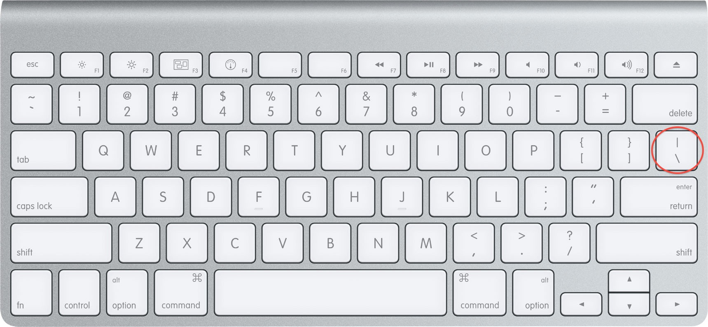

# Writing Good Documentation

## Step 1 - Using Codeblocks.

Codeblocks in markdown make it *very easy* for tech people to **copy, paste, share** code.
A good __Cloud Engineer__ uses Codeblocks whenever possible.

Because it allows others to copy and paste their code to replicate  or research issues.

- In order to create codeblocks in markdown you need to use three backticks (`)
- Not to be confused with qoutation (')
```
class Person
  attr_accessor :name, :age
  
  def initialize(name, age)
    @name = name
    @age = age
  end
  
  def introduction
    "Hi, my name is #{@name} and I am #{@age} years old."
  end
end

# Create two Person objects
person1 = Person.new("Alice", 30)
person2 = Person.new("Bob", 25)

# Print out their introductions
puts person1.introduction
puts person2.introduction
```

- When you can you should attemp to apply syntax highlighting to your codeblocks

```ruby
class Person
  attr_accessor :name, :age
  
  def initialize(name, age)
    @name = name
    @age = age
  end
  
  def introduction
    "Hi, my name is #{@name} and I am #{@age} years old."
  end
end

# Create two Person objects
person1 = Person.new("Alice", 30)
person2 = Person.new("Bob", 25)

# Print out their introductions
puts person1.introduction
puts person2.introduction
```

- Make note where the backtick keyboard key is located.
- It should appear above the tab key,
- but it may vary based on your keyboard layout.


Good Cloud Engineers use codeblock for both Code and Errors that appear in the console.

```bash
Traceback (most recent call last):
        2: from /usr/bin/irb:23:in `<main>'
        1: from (irb):1
RuntimeError: This is a custom error message
```

> Here is na example of using a codeblock for an error that appears in bash.

## Step 2 - Use Github Flavoured Markdown Task Lists

Github extends Markdown to have a list where you can check off items. [<sup>[1]</sup>](#external-references)

- [x] Finish Step 1
- [ ] Finish Step 2
- [x] Finish Step 3

## Step 3 - Use Emojis (Optional)

GitHub Flavored Markdown (GFM) supports emoji shortcodes. Here are some examples:
| Name | Shortode | Emoji |
| --- | --- | --- |
| Cloud | `:cloud:` | ☁️ |
| Cloud with lighting | `:cloud_with_lighting:` | 🌩️ |

Step 4 - how to create a table

You can use the following markdown format to create tables:
```md
| Name | Shortode | Emoji |
| --- | --- | --- |
| Cloud | `:cloud:` | ☁️ |
| Cloud with lighting | `:cloud_with_lighting:` | 🌩️ |
```
Github extends the functionality of Markdown tables to provide more alignment and table cell formatting options. [<sup>[2]</sup>](#external-references)

- Make note of where the pipe keyboard key is located.
- It should appear above return or enter key
- but it may vary based on your keyboard layout.



[Secret Window Hidden Garden](secret-window/hidden-garden.md)

## External References

- [GitHub Flavored Markdown Spec](https://github.github.com/gfm/) 
- [Basic writing and formatting syntax (GitHub Flavored Markdown)](https://docs.github.com/en/get-started/writing-on-github/getting-started-with-writing-and-formatting-on-github/basic-writing-and-formatting-syntax#quoting-text) 
- [GFM - Task List](https://docs.github.com/en/get-started/writing-on-github/getting-started-with-writing-and-formatting-on-github/basic-writing-and-formatting-syntax#task-lists) <sup>[1]</sup>
- [GFM - Emoji CheatSheet](https://github.com/ikatyang/emoji-cheat-sheet/)
- [GFM - Tables (with extensions)](https://github.github.com/gfm/#tables-extension-) <sup>[2]</sup>
